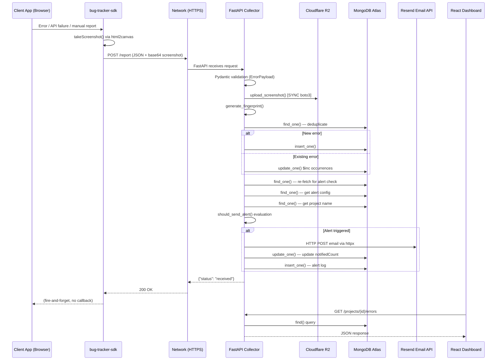
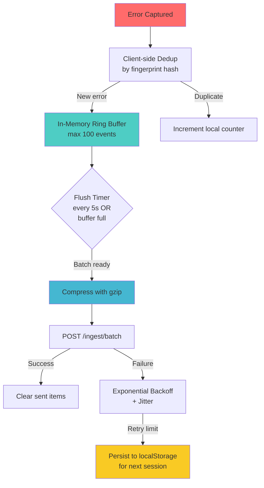
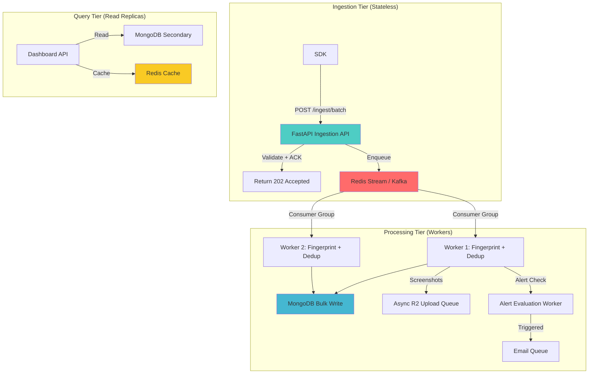

# BugTrace System Audit — Part 1: Architecture, SDK & Backend

> **Auditor perspective**: Staff+ Engineer who has built systems like Sentry, Datadog, and LogRocket.
> **Date**: April 2026 | **Codebase snapshot**: Current `main` branch

---

## 1. End-to-End Architecture Analysis

### 1.1 Current Data Flow



### 1.2 Critical Weak Points Identified

| Layer | Issue | Severity |
|-------|-------|----------|
| **SDK → Network** | No batching, no compression, no retry, no backoff | 🔴 Critical |
| **SDK → Network** | Base64 screenshots sent inline (1-5MB per event) | 🔴 Critical |
| **Network → Backend** | Vercel Serverless has 10s execution limit, cold starts | 🔴 Critical |
| **Backend (hot path)** | Synchronous R2 upload blocks the request | 🔴 Critical |
| **Backend (hot path)** | 4-6 MongoDB roundtrips per single event | 🔴 Critical |
| **Backend (hot path)** | Email dispatch in the ingestion hot path | 🔴 Critical |
| **Backend** | No request queue / backpressure mechanism | 🔴 Critical |
| **Backend** | pymongo is synchronous (blocks uvicorn event loop) | 🟡 High |
| **DB** | No TTL, no partitioning, unbounded document growth | 🟡 High |
| **DB** | Full payload stored in every error document | 🟡 High |
| **Frontend → Backend** | No pagination on error list queries | 🟡 High |
| **Security** | `.env` with production secrets committed to repo | 🔴 Critical |
| **Security** | CORS `allow_origins=["*"]` in production | 🟡 High |
| **Auth** | `/report` endpoint has no rate limiting | 🔴 Critical |

---

## 2. SDK (Node) Deep Dive

### 2.1 Current Architecture

```
sdk/src/
├── index.js              # Init & feature flags
├── sender.js             # Fire-and-forget fetch()
├── tracker.js            # window.onerror handler
├── fetchInterceptor.js   # Monkey-patches window.fetch
├── axiosInterceptor.js   # Axios response interceptor
├── manualBugReporter.js  # Shadow DOM bug report widget
├── performanceTracker.js # Web Vitals capture
├── takeScreenshot.js     # html2canvas full-page capture
└── utils/
    └── normalizer.js     # Base payload factory
```

### 2.2 Critical Issues

#### 🔴 ISSUE S-1: Fire-and-Forget with Zero Resilience

```javascript
// sender.js — The ENTIRE transport layer
export function sendError(payload) {
  fetch(`${collectorUrl}/report`, {
    method: "POST",
    headers: {
      "Content-Type": "application/json",
      "x-api-key": apiKey
    },
    body: JSON.stringify(payload)
  }).catch(() => {});  // ← Silently swallows ALL failures
}
```

**Impact at scale:**
- Network blip → data loss, **period**. No retry, no queue, no persistence.
- If collector is down for 5 minutes during a deployment: **every error across every client is permanently lost**.
- No backoff means if the server returns 429 or 503, the SDK will keep fire-hosing requests.
- `.catch(() => {})` means you have **zero visibility** into SDK transport failures.

#### 🔴 ISSUE S-2: Screenshot Payload Bomb

```javascript
// takeScreenshot.js
const canvas = await html2canvas(document.body);
return canvas.toDataURL("image/png"); // ← Returns raw base64, full page
```

**Problem**: `html2canvas(document.body)` captures the **entire page** as a full-resolution PNG.
- Average payload: **800KB–5MB of base64** per event.
- This is sent **inline in JSON** — no compression, no streaming, no chunked upload.
- At 100 events/sec with screenshots enabled, you're pushing **80MB–500MB/sec** through the ingestion pipeline.
- Vercel has a **4.5MB request body limit** for serverless functions. Screenshots exceeding this will silently fail.

**Sentry's approach for reference**: Sentry caps attachments at 100KB and uploads them separately via a dedicated attachment endpoint with chunked upload + content-addressed dedup.

#### 🔴 ISSUE S-3: No Batching Strategy

Every single error triggers an individual HTTP request. In a production app with a bad API endpoint returning 500s:

```
User opens page → 10 fetch calls fail → 10 individual HTTP requests to /report
× 1000 concurrent users = 10,000 requests per page load
```

This is **quadratic amplification** — the SDK becomes a DDoS tool against your own collector.

#### 🟡 ISSUE S-4: No Client-Side Rate Limiting

The `fetchInterceptor.js` intercepts **every** fetch call. If a client app has a polling endpoint that fails repeatedly (e.g., every 2 seconds), the SDK will generate **30 error reports per minute per user** for a single broken endpoint.

There is no:
- Deduplication (same error fingerprint seen recently)
- Rate limiter (max N events per time window)
- Circuit breaker (stop sending after N consecutive failures)

#### 🟡 ISSUE S-5: Blocking the User's App

```javascript
// fetchInterceptor.js
window.fetch = async (...args) => {
    // ...
    if (takeScreenshots) {
        screenshot = await takeScreenshot(); // ← Blocks on html2canvas
    }
    sendError(payload);
    return response; // ← User's response delayed until screenshot completes
};
```

When screenshots are enabled, `html2canvas` can take **200ms–2s** to render the page to canvas. This **blocks the return of the user's original fetch response**. The user's app literally freezes while we take a screenshot of their error.

#### 🟢 Minor: `html2canvas` Dependency Weight

`html2canvas` adds ~700KB to the SDK bundle (unpacked). For a "lightweight SDK", this is heavy. The dependency also doesn't support Shadow DOM, iframes, or complex CSS well.

### 2.3 Recommended SDK Architecture



**Specific recommendations:**

| Area | Current | Recommended |
|------|---------|-------------|
| Transport | Individual fire-and-forget | Batched with configurable flush interval (5s default) |
| Retry | None (`.catch(() => {})`) | Exponential backoff: 1s, 2s, 4s, 8s, 16s max, with jitter |
| Rate Limit | None | Token bucket: 30 events/minute per error type, 100/min total |
| Dedup | None (server-side only) | Client fingerprint cache with 60s TTL |
| Compression | None | `Content-Encoding: gzip` via CompressionStream API |
| Screenshots | Full-page base64 inline | Separate `/upload` endpoint, resize to 1280px max, JPEG at 60%, max 200KB |
| Persistence | None | `localStorage` queue with max 50 unsent events |
| Circuit Breaker | None | After 5 consecutive failures, pause for 60s |
| Payload Size | Unbounded | Max 100KB per event, 1MB per batch |

---

## 3. Backend (FastAPI) Deep Dive

### 3.1 The Fundamental Problem: Synchronous MongoDB on Async FastAPI

```python
# db.py
from pymongo import MongoClient  # ← SYNCHRONOUS client

# error_routes.py
@router.post("/report")
async def report_error(payload: ErrorPayload, request: Request):
    # ...
    project = projects_collection.find_one({"api_key": api_key})  # ← BLOCKS EVENT LOOP
    await ParseError(payload_dict, project["_id"])
```

You're using `pymongo` (synchronous) inside `async def` handlers. In uvicorn, this means:

1. When `find_one()` is called, it **blocks the entire event loop thread**.
2. While one request waits for MongoDB, **all other concurrent requests are stalled**.
3. With uvicorn's default 1 worker, a single slow MongoDB query freezes the entire server.

**This is the single biggest bottleneck in your system.**

> [!CAUTION]
> Using synchronous I/O (pymongo, boto3) inside `async def` FastAPI handlers blocks the event loop. This means your "async" server effectively processes requests **one at a time**. At 100 events/sec, this is an immediate failure point.

### 3.2 Ingestion Hot Path Analysis

Let me trace every I/O operation in a single `/report` call:

```python
async def ParseError(payload, project_id):
    # I/O 1: R2 upload (boto3 - SYNCHRONOUS, blocks ~200-1000ms)
    screenshot_url = upload_screenshot(payload["screenshot"])

    # I/O 2: MongoDB find (SYNCHRONOUS, blocks ~5-50ms)
    existing = errors_collection.find_one({...})

    # I/O 3: MongoDB write (SYNCHRONOUS, blocks ~5-50ms)
    errors_collection.update_one({...}) or errors_collection.insert_one({...})

    # I/O 4: MongoDB find (SYNCHRONOUS, blocks ~5-50ms) — re-fetch for alert
    updated_error = errors_collection.find_one({...})

    # I/O 5: MongoDB find (SYNCHRONOUS, blocks ~5-50ms) — get alert config
    config = alerts_config_collection.find_one({...})

    # I/O 6: MongoDB find (SYNCHRONOUS, blocks ~5-50ms) — get project name
    project = projects_collection.find_one({...})

    # I/O 7: HTTP POST to Resend (async httpx, but awaited inline ~200-500ms)
    success = await send_email_alert(recipients, email_payload)

    # I/O 8: MongoDB write (SYNCHRONOUS) — update notified count
    errors_collection.update_one({...})

    # I/O 9: MongoDB write (SYNCHRONOUS) — insert alert log
    alerts_logs_collection.insert_one({...})
```

**Total blocking time per request: 470ms – 1,800ms**

At 100 events/sec with single-threaded uvicorn: you can process **~0.5 – 2 events/sec**. That's a **50x–200x throughput deficit**.

### 3.3 Deployment Architecture Issue (Vercel Serverless)

```json
// vercel.json
{
  "functions": {
    "api/index.py": {
      "runtime": "python3.11"
    }
  }
}
```

Vercel Serverless Functions have:
- **10 second execution timeout** (Free/Pro tier)
- **4.5 MB request body limit**
- **Cold starts of 500ms–3s** for Python
- **No persistent connections** — MongoDB connection is re-established on every cold start
- **No WebSocket support** — can't do real-time streaming
- **No background processing** — function terminates when response is sent

This means:
- Every cold start pays the MongoDB connection penalty (`client.admin.command('ping')`) — that's ~1-3s.
- Your `errors_collection.create_index()` runs on **every cold start**, hammering MongoDB.
- Screenshot uploads + email sending must complete within 10s or the request times out.

### 3.4 Specific Code Issues

#### 🔴 ISSUE B-1: Double Request Body Parsing

```python
@router.post("/report")
async def report_error(payload: ErrorPayload, request: Request):
    raw_body = await request.json()  # ← Parses body AGAIN after Pydantic already parsed it
    payload_dict = payload.model_dump()  # ← Converts Pydantic model back to dict
```

You parse the request body twice — once by FastAPI/Pydantic (for validation) and once manually. Then you convert the validated model back to a dict. This is wasteful and bypasses the validation you just did.

#### 🔴 ISSUE B-2: Unbounded Error Document Growth

```python
update_data = {
    "payload": payload   # 🔥 Stores the ENTIRE incoming payload on every update
}
```

Every time an error re-occurs, you **overwrite the stored payload** with the latest one. But the payload includes screenshots (base64), full stack traces, request/response data. A single error document can grow to **5-10MB** if screenshots are enabled. MongoDB has a **16MB document limit** — you'll hit it.

#### 🔴 ISSUE B-3: No Input Validation on `/report`

```python
project = projects_collection.find_one({"api_key": api_key})
```

- No rate limiting per API key.
- No payload size limit.
- No validation that the API key format is correct before hitting the database.
- A malformed or stolen API key will cause a database lookup on **every request**.

#### 🟡 ISSUE B-4: Duplicate Route Definitions

```python
# error_routes.py
@router.get("/projects/{project_id}/errors")

# project_routes.py  
@router.get("/projects/{project_id}/errors")  # ← SAME ROUTE, different handler!
```

Both `error_routes.py` and `project_routes.py` define `GET /projects/{project_id}/errors`. FastAPI will use the first registered one and silently ignore the second. One of these handlers also references `errors_collection` without importing it properly.

#### 🟡 ISSUE B-5: No Pagination

```python
def get_project_errors(project_id: str):
    errors = list(errors_collection.find({...}))  # ← Returns ALL errors, no limit
    return errors
```

With 100,000 errors for a project, this returns **every single document** in one response. That's potentially hundreds of megabytes of JSON. No pagination, no cursor, no limit.

### 3.5 Recommended Backend Architecture



**Key changes:**
1. **Decouple ingestion from processing**: Return `202 Accepted` immediately. Process asynchronously.
2. **Use `motor` instead of `pymongo`**: Native async MongoDB driver.
3. **Batch DB writes**: Use `bulk_write()` instead of individual `insert_one()`/`update_one()`.
4. **Move screenshots off the hot path**: Upload asynchronously via a separate queue.
5. **Move email alerts off the hot path**: Evaluate and send via a background worker.
6. **Add Redis caching**: Cache project lookups, alert configs (these rarely change).
