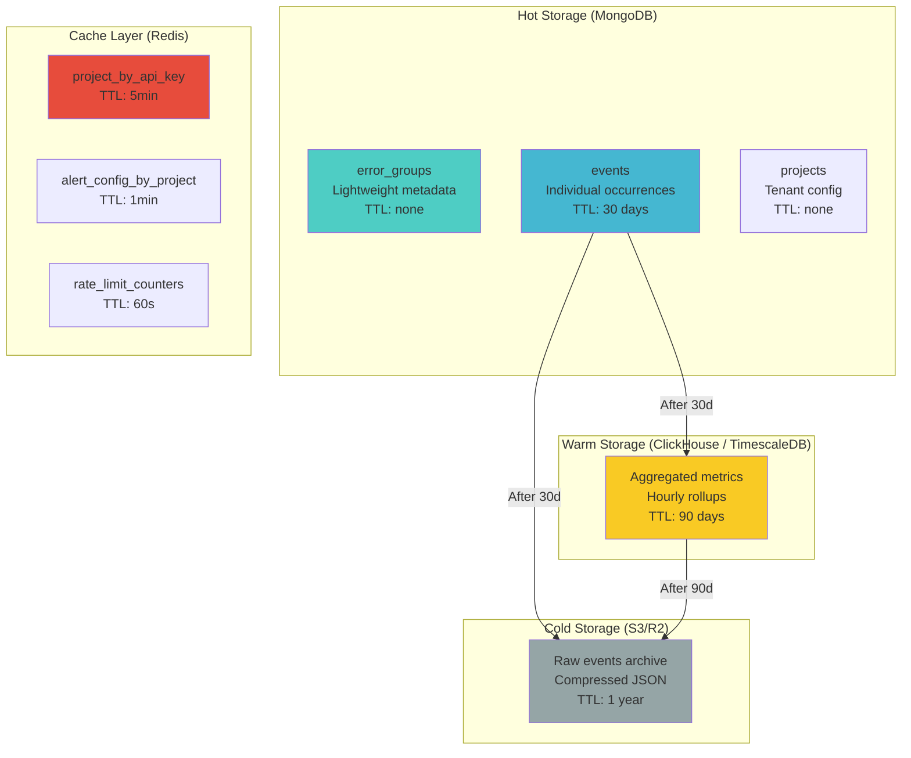
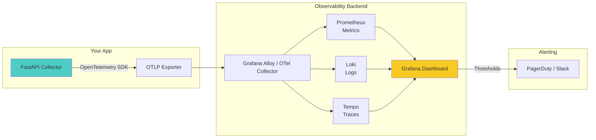

# BugTrace System Audit — Part 2: Data Layer, Failures & Observability

---

## 4. Data Layer (Critical)

### 4.1 Current Schema Analysis

Your MongoDB has these collections:

| Collection | Purpose | Write Pattern | Read Pattern |
|-----------|---------|---------------|--------------|
| `users` | User accounts | Low (sign-up only) | Auth lookups |
| `projects` | Tenant projects | Low (creation only) | API key lookups on every event |
| `errors` | Error groups (deduplicated) | **High** (every ingested event) | Dashboard queries |
| `alert_configs` | Per-project alert rules | Rare (settings changes) | Every ingested event |
| `alert_logs` | Alert history | Medium (on alert trigger) | Dashboard audit view |

### 4.2 Error Document Schema (Reconstructed)

```json
{
    "_id": ObjectId,
    "project_id": ObjectId,
    "fingerprint": "sha256_hash",
    "event_type": "api_error | unhandled_exception | manual | performance",
    "occurrences": 14582,
    "first_seen": ISODate,
    "last_seen": ISODate,
    "location": { "file": "...", "line": 42, "column": 7 },
    "is_ticket_generated": false,
    "ticket_url": null,

    "payload": {                    // ⚠️ ENTIRE last payload stored here
        "timestamp": "...",
        "event_type": "...",
        "error": { "message": "...", "stack": "..." },
        "request": { "url": "...", "method": "POST", "payload": "..." },
        "response": { "status": 500, "data": "..." },
        "client": { "url": "...", "browser": "..." },
        "metadata": { ... },
        "screenshot": "data:image/png;base64,iVBOR..."  // ⚠️ 1-5MB base64
    },

    "screenshot_url": "https://r2.dev/screenshots/uuid.png",
    "lastNotifiedAt": ISODate,
    "notifiedCount": 42
}
```

### 4.3 Critical Data Layer Issues

#### 🔴 ISSUE D-1: Error Documents Are Unbounded Time-Bombs

The `payload` field stores the **complete last event payload**, including potential base64 screenshots. MongoDB has a **16MB document size limit**. Even without screenshots, request/response payloads from complex API calls can be several KB each. Over time, a single error document with evolving payloads will grow unpredictably.

**But the real problem is worse**: You're storing the **last** payload only. This means:
- You lose **all historical event data** except the most recent occurrence.
- You can't analyze trends within an error group (e.g., "which user agents are affected?").
- You can't replay events for debugging.

**How Sentry does it**: Sentry separates **Issue Groups** (lightweight metadata) from **Events** (individual occurrences). Each event is stored independently with its own payload. Groups aggregate counts and metadata.

#### 🔴 ISSUE D-2: Missing Indexes

Current indexes:
```python
errors_collection.create_index(
    [("project_id", 1), ("fingerprint", 1)],
    name="idx_project_fingerprint"
)
```

Missing critical indexes:

| Query Pattern | Missing Index | Impact |
|--------------|---------------|--------|
| `find({"api_key": api_key})` on projects | `projects.api_key` (unique) | **Full collection scan on every event** |
| `find({"fingerprint": fingerprint})` | `errors.fingerprint` (unique) | Collection scan on error detail page |
| `find({"project_id": X}).sort("last_seen", -1)` | `errors.(project_id, last_seen)` | Slow dashboard loads |
| `find({"projectId": X})` on alert_configs | `alert_configs.projectId` (unique) | Extra latency per event |
| `find({"email": email})` on users | `users.email` (unique) | Slow auth lookups |

> [!WARNING]
> The `projects.api_key` index is the most critical missing piece. Every single ingested event does `projects_collection.find_one({"api_key": api_key})`. Without an index, this is a **full collection scan** — O(n) where n = total projects. At 100+ projects, this adds significant latency to every request.

#### 🔴 ISSUE D-3: No Data Retention / TTL Strategy

There is zero data lifecycle management:
- Errors accumulate forever.
- Alert logs accumulate forever.
- No archiving, no compaction, no cold storage.

At 1,000 events/sec:
- ~86M events/day
- ~2.6B events/month
- Average event document size (without screenshot): ~2-5KB
- Monthly storage: **5-13TB**

MongoDB Atlas costs for this volume: **$5,000–$15,000/month**.

#### 🟡 ISSUE D-4: No Write Concern Strategy

```python
client = MongoClient(mongo_uri, retryWrites=True, w="majority")
```

`w="majority"` ensures durability but adds latency (~10-50ms per write). For high-volume event ingestion, this is overkill. Events are ephemeral data — losing one error occurrence out of 14,582 is not critical. You should use `w=1` for the hot ingestion path and `w="majority"` only for critical operations (user creation, project creation).

### 4.4 Recommended Data Architecture



**Schema redesign:**

```javascript
// Collection: error_groups (lightweight, long-lived)
{
    "_id": ObjectId,
    "project_id": ObjectId,
    "fingerprint": "sha256",
    "event_type": "api_error",
    "first_message": "Request failed with status 500",
    "location": { "file": "...", "line": 42 },
    "occurrences": 14582,
    "first_seen": ISODate,
    "last_seen": ISODate,
    "status": "open | resolved | muted",
    "assigned_to": null,
    "is_ticket_generated": false,
    "ticket_url": null,
    "tags": ["production", "critical"],
    // NO payload, NO screenshot
}

// Collection: events (individual occurrences, TTL-managed)
{
    "_id": ObjectId,
    "group_fingerprint": "sha256",
    "project_id": ObjectId,
    "timestamp": ISODate,
    "error": { "message": "...", "stack": "..." },
    "request": { "url": "...", "method": "POST" },
    "response": { "status": 500 },
    "client": { "url": "...", "browser": "..." },
    "screenshot_url": "https://r2.dev/...",  // URL only, never base64
    "metadata": { ... },
    // TTL index: auto-delete after 30 days
    "created_at": ISODate  // TTL field
}
```

**Index strategy:**
```python
# error_groups
db.error_groups.create_index([("project_id", 1), ("last_seen", -1)])
db.error_groups.create_index("fingerprint", unique=True)

# events
db.events.create_index([("group_fingerprint", 1), ("timestamp", -1)])
db.events.create_index("created_at", expireAfterSeconds=30*24*3600)  # 30-day TTL

# projects
db.projects.create_index("api_key", unique=True)
db.projects.create_index("user_id")

# alert_configs
db.alert_configs.create_index("projectId", unique=True)

# users
db.users.create_index("email", unique=True)
db.users.create_index("clerk_id", unique=True, sparse=True)
```

### 4.5 Cost-Optimized Storage Tiers

| Tier | Technology | Data | Retention | Cost (est.) |
|------|-----------|------|-----------|-------------|
| **Hot** | MongoDB Atlas M30+ | Error groups + Recent events | 30 days | $500-2,000/mo |
| **Warm** | ClickHouse Cloud or TimescaleDB | Aggregated hourly metrics | 90 days | $100-500/mo |
| **Cold** | Cloudflare R2 (already used) | Compressed event archives | 1 year | $15-50/mo |
| **Cache** | Redis (Upstash or ElastiCache) | API key lookups, alert configs | TTL-based | $20-100/mo |

---

## 5. Failure Scenarios

### Scenario 1: 10x Traffic Spike

| Aspect | Detail |
|--------|--------|
| **Trigger** | Customer deploys broken code. Error rate jumps from 100/sec to 1,000/sec |
| **Root Cause** | No backpressure mechanism. SDK sends every error individually. No rate limiting per tenant |
| **Impact** | MongoDB connection pool exhausted. Vercel concurrent execution limit hit. All tenants affected (noisy neighbor) |
| **Detection** | Currently: **NONE**. You won't know until users report the dashboard is down |
| **Mitigation P0** | Add per-API-key rate limiting (Redis token bucket: 100 events/sec/project). Return `429` above threshold |
| **Mitigation P1** | SDK client-side rate limit (30/min default). Batch events. Ingestion queue decoupling |
| **Mitigation P2** | Auto-scaling ingestion tier. Per-tenant event quotas with billing tiers |

### Scenario 2: Noisy Neighbor (One Tenant Floods System)

| Aspect | Detail |
|--------|--------|
| **Trigger** | Tenant A has a loop that generates 50,000 errors/sec. All other tenants degraded |
| **Root Cause** | No tenant isolation. Single MongoDB instance shared. No per-tenant resource limits |
| **Impact** | Tenant A's write load saturates MongoDB. Dashboard queries for all tenants timeout. Alert emails delayed or lost |
| **Detection** | Monitor events/sec per `project_id`. Alert when any single tenant exceeds 10x their 7-day baseline |
| **Mitigation P0** | Server-side rate limit: hard cap of 1,000 events/sec per API key. Respond with `429` and `Retry-After` header. **This is the single most important feature to build** |
| **Mitigation P1** | SDK-side configurable rate limit. Circuit breaker after 5 consecutive `429`s |
| **Mitigation P2** | Per-tenant resource allocation. Separate MongoDB collections or databases per tier |

### Scenario 3: MongoDB Connection Exhaustion

| Aspect | Detail |
|--------|--------|
| **Trigger** | Serverless cold starts create new `MongoClient` instances. Under load, 50+ concurrent functions each open a connection pool |
| **Root Cause** | `MongoClient` is initialized at module level. Vercel serverless creates a new instance per cold start. No connection pooling across invocations |
| **Impact** | MongoDB Atlas connection limit (500 for M10) exhausted. All new requests fail with connection timeout |
| **Detection** | MongoDB Atlas monitoring → Connections metric → Alert at 80% of limit |
| **Mitigation P0** | Set `maxPoolSize=5` in MongoClient config. Use connection string parameter `?maxPoolSize=5` |
| **Mitigation P1** | Move off Vercel serverless to a persistent process (Railway, Fly.io, AWS ECS) with a single shared connection pool |
| **Mitigation P2** | Use MongoDB Atlas Data API (HTTP-based, no connection pooling needed) for serverless |

### Scenario 4: SDK Retry Storm

| Aspect | Detail |
|--------|--------|
| **Trigger** | Collector goes down for 2 minutes during deployment. When it comes back, all SDKs retry simultaneously |
| **Root Cause** | Currently: No retry at all (`.catch(() => {})`) — so this is actually "silent data loss". But if you add retry without backoff + jitter, this becomes a thundering herd |
| **Impact** | Server comes back online and immediately receives 10x normal traffic as all clients retry buffered events |
| **Detection** | Ingestion rate spike after deployment. Should be a standard alert |
| **Mitigation** | Exponential backoff with **full jitter**: `delay = random(0, min(cap, base × 2^attempt))`. This is AWS's recommended approach. Stagger client retries across a wide time window |

### Scenario 5: Screenshot Upload Timeout Cascading Failure

| Aspect | Detail |
|--------|--------|
| **Trigger** | Cloudflare R2 has a temporary outage or high latency (>5s) |
| **Root Cause** | `upload_screenshot()` is synchronous boto3 in the hot path. 5s R2 timeout + 5s retry = 10s. Vercel serverless timeout: 10s |
| **Impact** | Every event with a screenshot hits the 10s timeout. Function terminates before MongoDB write. Event data lost. R2 latency cascades into MongoDB write failures |
| **Detection** | Currently: `try/except` silently catches and sets `screenshot_url = None`. But the blocking time still delays everything else |
| **Mitigation P0** | Move screenshot upload completely off the hot path. Store base64 temporarily, upload via background job |
| **Mitigation P1** | Use pre-signed upload URLs. SDK uploads directly to R2, sends only the URL to the collector |
| **Mitigation P2** | SDK-side compression. Resize screenshots to 1280px max width, JPEG 60% quality |

### Scenario 6: Email Service (Resend) Failure

| Aspect | Detail |
|--------|--------|
| **Trigger** | Resend API returns 500 or rate limit (429) |
| **Root Cause** | Email is sent in the `/report` hot path. `send_email_alert()` is awaited inline |
| **Impact** | If Resend is slow (2s response), every event that triggers an alert takes 2s+ to process. If Resend is down, alert emails are permanently lost (no retry queue) |
| **Detection** | Should log Resend failures with response codes. Currently prints to stdout but doesn't persist |
| **Mitigation P0** | Move email sending completely out of the ingestion path. Use a simple database-backed email queue |
| **Mitigation P1** | Add retry with backoff for failed emails. Dead letter queue for permanently failed sends |

### Scenario 7: Fingerprint Collision / Misclassification

| Aspect | Detail |
|--------|--------|
| **Trigger** | Two different errors produce the same fingerprint hash. Or: one error with different root causes gets grouped together |
| **Root Cause** | Aggressive normalization (`normalize_message` strips all numbers and quoted strings). `re.sub(r"\d+", "", message)` turns `"Cannot read property of undefined at line 42"` and `"Cannot read property of undefined at line 99"` into the same fingerprint |
| **Impact** | Separate bugs get merged into one group. Occurrence count is inflated. Users see wrong stack traces. Alert thresholds triggered incorrectly |
| **Detection** | No current detection. Would only be noticed if a user reports seeing unrelated payloads in a single error group |
| **Mitigation** | Include the **top 3 stack frames** (not just top 1) in the fingerprint. Don't strip numbers from file paths and line numbers. Separate the "display message" from the "grouping key" |

### Scenario 8: Partial Backend Outage (Database Up, API Degraded)

| Aspect | Detail |
|--------|--------|
| **Trigger** | Vercel deploys a broken version. `/report` endpoint works but returns 500. Dashboard endpoints work fine |
| **Root Cause** | No health check beyond `GET /` returning static JSON. No synthetic monitoring. No canary deployment |
| **Impact** | All incoming events are lost. Dashboard shows stale data. Users think system is working because dashboard loads |
| **Detection** | Need synthetic `/report` test that sends a canary event every 60s and verifies it appears in the DB |
| **Mitigation P0** | Health check endpoint that actually verifies MongoDB connectivity and write capability |
| **Mitigation P1** | Canary event system: send synthetic errors from a monitoring service, alert if they don't appear within 2 minutes |

---

## 7. Observability (Dogfooding)

### 7.1 The Irony

You're building an observability tool with **zero observability into itself**. There are print statements everywhere (`print(f"❌ Error in alerting system: {str(e)}")`), but no structured logging, no metrics, no traces.

### 7.2 Key Metrics to Track

| Metric | Type | Source | Alert Threshold |
|--------|------|--------|----------------|
| `ingestion.events_per_second` | Counter | `/report` handler | Spike: >10x baseline |
| `ingestion.latency_p99` | Histogram | `/report` handler | >2s |
| `ingestion.error_rate` | Rate | `/report` 5xx responses | >1% |
| `ingestion.payload_size_bytes` | Histogram | Request body | >1MB |
| `db.query_latency_ms` | Histogram | All MongoDB ops | p99 >100ms |
| `db.connection_pool_used` | Gauge | MongoClient stats | >80% of max |
| `db.write_errors` | Counter | MongoDB write results | Any |
| `screenshot.upload_latency_ms` | Histogram | R2 upload | >3s |
| `screenshot.upload_failures` | Counter | R2 errors | >5/min |
| `alert.evaluation_count` | Counter | Alert service | Baseline tracking |
| `alert.email_sent_count` | Counter | Email service | Baseline tracking |
| `alert.email_failure_count` | Counter | Email service errors | >0 |
| `api_key.lookup_latency_ms` | Histogram | Project lookup | >50ms |
| `events_per_project` | Gauge (per project_id) | Ingestion | >1000/sec (noisy neighbor) |

### 7.3 Recommended Stack



**Pragmatic alternative for early stage**: Use **Grafana Cloud Free Tier** (10K metrics, 50GB logs, 50GB traces) + **BetterStack** for uptime monitoring. Total cost: $0.

### 7.4 Structured Logging Example

Replace all `print()` statements:

```python
import structlog

logger = structlog.get_logger()

# Instead of: print(f"❌ Error in alerting system: {str(e)}")
logger.error("alert_system_failure",
    project_id=str(project_id),
    fingerprint=fingerprint,
    alert_type=alert_type,
    error=str(e),
    exc_info=True
)

# Instead of: print("sending alert to", recipients)
logger.info("alert_email_sending",
    project_id=str(project_id),
    fingerprint=fingerprint,
    recipient_count=len(recipients),
    alert_type=alert_type
)
```

### 7.5 Health Check Endpoint (Implement Immediately)

```python
@app.get("/health")
async def health_check():
    checks = {}
    
    # MongoDB
    try:
        client.admin.command('ping')
        checks["mongodb"] = "ok"
    except Exception as e:
        checks["mongodb"] = f"error: {str(e)}"
    
    # R2
    try:
        r2.head_bucket(Bucket=BUCKET_NAME)
        checks["r2"] = "ok"
    except Exception as e:
        checks["r2"] = f"error: {str(e)}"
    
    all_ok = all(v == "ok" for v in checks.values())
    
    return {
        "status": "healthy" if all_ok else "degraded",
        "checks": checks,
        "timestamp": datetime.utcnow().isoformat()
    }
```
