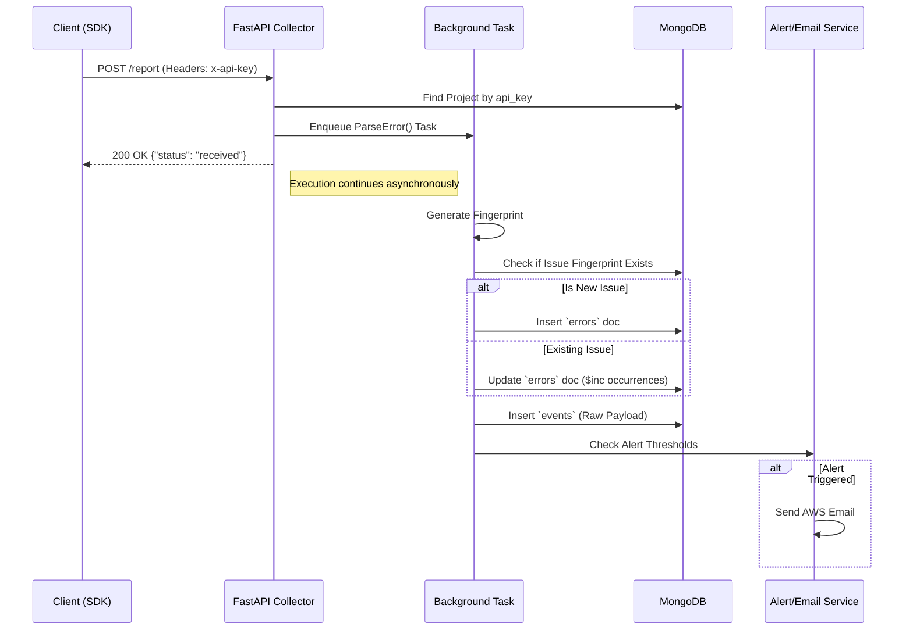

# BugTrace Technical Documentation

This document serves as the comprehensive architectural and technical reference for the **BugTrace** ecosystem. It outlines the current state of the codebase, design tradeoffs, execution flow, gaps, and the recommended roadmap.

---

## 1. 📖 Project Overview

**Purpose:** 
BugTrace is a lightweight error tracking, logging, and performance monitoring system designed to provide real-time visibility into web application health.

**Problem it Solves:** 
It captures unhandled client-side exceptions, failed API requests, and frontend performance bottlenecks, automatically converting them into structured, actionable telemetry data before users report them. 

**Target Users:** 
Web Application Developers, QA Engineers, and DevOps teams.

**Key Features (Derived from Code):**
*   **Global Exception Tracking:** Captures uncaught frontend exceptions automatically.
*   **Contextual Overlays:** Takes base64 screenshots using `html2canvas` for precise UI context on error.
*   **Performance Streaming:** Dedicated telemetry stream (DNS, TTFB, FCP, API durations).
*   **Intelligent Alerting:** Spike-based and new-error email alerts (via AWS SES) with offline-queue fallback (`pending_alerts`).
*   **Ticket Integration:** Automated bug creation in OpenProject.
*   **Breadcrumbs:** Tracks chronological sequence of user actions leading up to errors.
*   **Network Interception:** Axios and Fetch interceptors to track network failures natively.

---

## 2. 🏗️ System Architecture

**High-Level Architecture:**
The platform follows a Distributed Component Architecture, relying on three primary boundaries: the loosely coupled **Frontend Client (SDK)**, the high-throughput **Ingestion Backend (FastAPI)**, and the **Dashboard App (React)**.

**Architecture Paradigm:** Service-Oriented (Transitioning toward Microservices)

```mermaid
graph TD
    classDef client fill:#f9f,stroke:#333,stroke-width:2px;
    classDef backend fill:#bbf,stroke:#333,stroke-width:2px;
    classDef db fill:#bfb,stroke:#333,stroke-width:2px;

    SDK(Client SDK - Vanilla JS) ::: client
    Dashboard(BugTracker UI - React) ::: client

    subgraph FastAPI Collector Backend
        RateLimit[Security Middleware] 
        AuthRoutes[Auth & Clerk Sync]
        Ingestion[Ingestion /report]
        PerfIngestion[Performance /report/performance]
        Worker(BackgroundTask Thread Pool)
    end ::: backend

    MongoDB[(MongoDB + Motor Async)] ::: db
    
    OpenProject([OpenProject API])
    AWS_SES([AWS SES / Email])
    Clerk([Clerk Auth])

    SDK -->|X-API-Key| RateLimit
    RateLimit --> Ingestion
    RateLimit --> PerfIngestion
    
    Dashboard --> AuthRoutes
    Dashboard --> Clerk
    AuthRoutes --> Clerk
    
    Ingestion -.->|Enqueue| Worker
    Worker -->|Group & Deduplicate| MongoDB
    PerfIngestion -->|Direct Insert| MongoDB
    
    Worker -->|Spike/New Error| AWS_SES
    Dashboard -->|REST| RateLimit
    RateLimit --> OpenProject
```

**Data Flow Highlight:**
Ingestion operates async-first. API calls queue into `BackgroundTasks` threads, rendering the HTTP response immediately to scale up under concurrent bursts.

---

## 3. ⚙️ Tech Stack

**Frontend (Dashboard / Playground):**
*   **Framework:** React 19 / Vite
*   **Styling:** Tailwind CSS, class-variance-authority, clsx, tailwind-merge (shadcn-like utilities).
*   **State Management:** Zustand (Auth states), React Query (Async Server State & Caching).
*   **Charting:** Recharts (Performance visualizations).
*   **Auth Provider:** Clerk (via `@clerk/clerk-react`).

**Backend (Collector):**
*   **Framework:** FastAPI (Python), Uvicorn.
*   **Data Validation:** Pydantic.
*   **Logging:** `structlog` (JSON patterned logs).
*   **Services:** `boto3` (AWS integration), `jwt` (Internal auth).

**Database & Storage:**
*   **Primary Database:** MongoDB.
*   **ODM/Driver:** `motor` (AsyncIOMotorClient).

**SDK (Client Package):**
*   **Language:** Vanilla JS / ES Modules.
*   **Build Tool:** `tsup` (outputs esm, cjs).
*   **Dependencies:** `html2canvas` (screenshots).

**DevOps / Deployment:**
*   **Hosting Configuration:** `vercel.json`, `Procfile` indicate Vercel / Heroku combinations.
*   **Scripting:** `start_dev.sh` to initialize dev environments.

---

## 4. 📁 Codebase Structure

*   **/bug-tracker (Dashboard Application)**
    *   `src/pages`: Screens like Error Details, Settings, Tickets.
    *   `src/components`: UI layout, Clerk Sync bridging component.
    *   `src/store`: Zustand stores (`auth.ts`).
*   **/collector (Backend Service)**
    *   `app/routes`: Separated logic vectors (`error_routes`, `performance_routes`, etc.).
    *   `app/services`: External integrations (`ticket_service`, `db`, `openproject_service`).
    *   `app/models`: Pydantic domain models.
    *   `app/utils`: Parsers and heavy algorithmic items (stack parser, encryption, API key gen).
*   **/sdk (JavaScript Plugin)**
    *   `src/index.js`: Primary builder/initializer function.
    *   `src/tracker.js`: Global window exception hook mapping.
    *   `src/performanceTracker.js`: Pulls `performance.getEntries()`.
*   **/playground**
    *   A simulated vite-react application pulling the SDK locally via `file:../sdk` dependency for testing.

---

## 5. 🔐 Authentication & Authorization

**Hybrid Auth Pipeline Strategy:**
1.  **Frontend Boundary:** Handled primarily by **Clerk**.
2.  **Auth Sync:** Post Clerk confirmation, `ClerkSync` explicitly hits the backend (`/auth/clerk-sync`) creating an internal mirror document in the `users` collection.
3.  **Backend Protected Routes:** Handled via custom JWT (`PyJWT`). Endpoint requires a `Bearer <token>` verified via a `Depends(verify_token)` FastAPI security dependency.

**Entity Ingestion Auth:**
The `/report` routes do not use Auth tokens. They use an `X-API-Key` HTTP Header statically mapped to `projects_collection` entries.

**Security Constraints:**
*   Missing proper key scrubbing in logs.
*   JWT Falls back to a hardcoded insecure key (throws a `logger.error` on start if not configured properly).

---

## 6. 🔌 API Design

### POST `/report`
*   **Purpose:** Error ingestion queue payload.
*   **Schema:** `ErrorPayload` / `List[ErrorPayload]`
*   **Notes:** Prevents performance metrics from using this route directly via explicit string validation. Enqueues background ParseError tasks.

### POST `/report/performance`
*   **Purpose:** Dedicated metrics pipe.
*  **Schema:** `PerformancePayload` (includes network timings like `ttfb`, `fcp`, `domContentLoaded`).
*   **Response:** `{"status": "ok", "batch_size": int}`

### GET `/projects/{project_id}/errors`
*   **Purpose:** Paginated list of issue groups.
*   **Response Schema:** `{"page": int, "limit": int, "total": int, "data": List[...]} `

### POST `/projects/{project_id}/integrations/openproject`
*   **Purpose:** Register ticketing mapping.
*   **Body:** `{"base_url": string, "api_key": string, "project_id": string}`.
*   **Security:** Decrypts incoming key from frontend, re-encrypts natively, and persists in DB.

### PUT `/projects/{project_id}/alert-config`
*   **Purpose:** Sets alerting thresholds.
*   **Body:** `AlertConfigSchema` (Channels, SpikeTriggers thresholds).

---

## 7. 🗄️ Database Design

**Type:** MongoDB (NoSQL)
**Client:** Motor Async Client

**Collections & Schemas:**
*   `projects`: Contains `api_key` (Indexed for fast lookups) and integrations nested blocks.
*   `errors`: Groups unique issues. Tracks `occurrences`, `first_seen`, `last_seen`. (Compound Index: project_id + fingerprint).
*   `events`: The atomic telemetry occurrences. Retains heavy payloads and screenshots. (TTL Index: 30 days). Uses `WriteConcern(w=1)`.
*   `performance_metrics`: Time-series data points. Indexed on `(project_id, route)` and expires strictly after 90 days.
*   `pending_alerts`: Outbox queue for alerting systems when AWS SES explicitly fails.

---

## 8. 🔄 Data Flow (End-to-End)

**Error Reporting Sequence Flow:**



---

## 9. 🚀 Performance & Scalability

**Current Optimizations (Codebase Derived):**
*   **Background Tasks:** Ingestion immediately releases HTTP connections by utilizing FastAPI `BackgroundTasks`.
*   **Degraded Consistency for Speed:** `events` collection writes apply `write_concern(w=1)` (non-majority acknowledgment).
*   **TTL Harvesting:** Database size dynamically managed via MongoDB background expiration indexes.
*   **Connection Pooling:** 10 max sockets natively kept warm inside Motor.

**Bottlenecks:**
*   `rate_limit_cache` inside `main.py` is a native python dictionary. In deployments with multiple workers/processes (Uvicorn clustered), rate limits leak and fail horizontally.
*   `upload_screenshot()` runs synchronously inside `ticket_service.py` under the Async pool.
*   FastAPI `BackgroundTasks` holds all tasks in application memory. Pod restarts will result in data loss.

**Horizontal Scaling Strategy:**
*   *Immediate:* Replace python dict memory cache with a Redis Cache.
*   *Long-Term:* Move `/report` to push payloads natively into an Apache Kafka or AWS SQS broker. Pull from workers to persist to Mongo.

---

## 10. 🧠 State Management (Frontend)

*   **Zustand:** Controls Auth metadata, enforcing synchronous UX unblocking during hard refreshes via `session` localStorage overrides.
*   **React-Query (`@tanstack/react-query`):** Manages strictly external server state. Highly prominent in Dashboard views caching `/projects/` endpoints.
*   **Context Safety:** The `ProtectedRoute` natively polls `isLoaded` contexts from Clerk while masking UI stutters.

---

## 11. 🐞 Error Handling & Logging

*   **Collector Application Logs:** Utilizes `structlog` forcing immutable JSON logging to stdout. Example: `logger.info("service_startup", status="initializing")`.
*   **Exception Shields:** All endpoints explicitly catch broad unhandled scope returning `500` JSON blocks preventing stack strace leakage. 
*   **The SDK Layer:** Hooks `window.onerror`, intercepts `XMLHttpRequest` via fetch/axios patching native prototype constructors.

---

## 12. 🧪 Testing

*   *Assumption / Gap:* While a `tests/` directory and `pytest` are included natively entirely no coverage references or configuration exist in the base directory. Unit, Integration, and E2E coverage is severely lacking.

---

## 13. 🔁 CI/CD & Deployment

*   **Environments:** `start_dev.sh` used exclusively for local orchestration.
*   **Builds:** Package build processes explicitly utilize `tsc -b && vite build` and `tsup`.
*   *Assumption / Gap:* CI pipeline files (GitHub actions, GitLab CI) are entirely omitted from source control.

---

## 14. 🔒 Security Analysis

**Strengths:**
*   `SecurityGuard` middleware rigorously terminates payloads `> 500KB`.
*   Payload API integrations dynamically decrypt inbound API keys and store them inside Mongo uniquely re-encrypted (`app.utils.encryption`).

**Vulnerabilities / Risks:**
1.  **JWT Integrity:** The default fallback `your-secret-key-change-in-production` will instantly comprise environments if skipped.
2.  **API Rate Limiting State:** Per-pod memory states easily manipulated by load-balancer round-robining (as mentioned in Architecture).

---

## 15. ⚠️ Gaps & Technical Debt

*   **Sync Execution in Async Block:** Missing complete asyncio utilization (e.g. `boto3` calls for s3 inside async handlers block the main executor event loop threads).
*   **Queue Durability Loss:** Relying entirely on RAM to offload `ParseError` prevents reliable data ingestions. If the collector crashes, in-flight background logs are destroyed indefinitely.
*   **Testing Void:** Lack of mocked testing creates fragility around payload variations dynamically sent from `SDK`.
*   **Duplication of Responsibility:** Auth tokens operate in dual streams across Clerk and PyJWT native generations leading to eventual synchronization bugs.

---

## 16. 📈 Improvement Roadmap

*   **Phase 1 (Stabilization):**
    *   Swap `rate_limit_cache` native dict to Redis wrapper.
    *   Replace synchronous screenshot AWS calls to `aioboto3`.
*   **Phase 2 (Durability):**
    *   Implement Redis/Celery queue for `ParseError` preventing memory explosion under high SDK traffic.
    *   Standardize testing patterns.
*   **Phase 3 (Enterprise Support):**
    *   GraphQL transition for flexible dashboard API queries.
    *   Implementing sampling/burst protection dropping payloads earlier in the Middleware layer upon reaching usage quotes via Organization ID.

---

## 17. 📊 Observability

*   **Metrics:** Structlog metrics internally used; however, standard Prometheus telemetry endpoints (e.g., `/metrics`) are absent.
*   **Tracing:** Log contextual identifiers lack standard generic Zipkin/Jaeger span contexts.
*   **Alerting:** Proactive email alerting natively built to ping users upon spikes in platform errors (Custom Business logic monitoring).

---

## 18. 🧩 External Integrations

*   **AWS SES / S3:** Screenshots storage and outgoing alert communications via standard `boto3` library implementations.
*   **OpenProject:** Automated mapping from BugTrace events -> Work Package tickets via `httpx.AsyncClient` REST calls.
*   **Clerk:** High-tier OAuth login tracking provider natively utilized on Dashboard edges.

---

## 19. 🧠 Design Decisions & Tradeoffs

1.  **Collection Separation (`errors` vs `events`):** 
    *   *Decision:* Rather than burying gigabytes of logs inside huge objects, an `errors` table handles metadata and aggregate counters (used 90% of the time for dashboards), while `events` manages granular row-level data (TTL explicitly purges this to save DB costs).
2.  **Hybrid Clerk/Custom Auth:**
    *   *Decision:* Using Clerk limits API route authorization unless explicitly requesting Clerk tokens. Implementing pure internal tokens post-login yields higher performance authorization loops but trades off single-source-of-truth reliability.
3.  **Client-Side Base64 Rendering (html2canvas):**
    *   *Decision:* Instead of utilizing Puppeteer backend proxies, `html2canvas` delegates load computing heavily onto user browsers saving immense backend bandwidth but risks missing obscure CSS configurations native to absolute device-bounds.

---

## 20. 📚 Appendix

**Critical Environment Variables Required:**
```env
# Backend
MONGO_URI=mongodb+srv://...
JWT_SECRET_KEY=...
ALLOWED_ORIGINS=http://localhost:5173
AWS_ACCESS_KEY_ID=...
AWS_SECRET_ACCESS_KEY=...
FRONTEND_URL=xyz
```
**Start Script (`start_dev.sh`):**
Requires execution permission patching (`chmod +x`). Handles spawning multi-proc environments orchestrating vite clients and uvicorn servers simultaneously.
