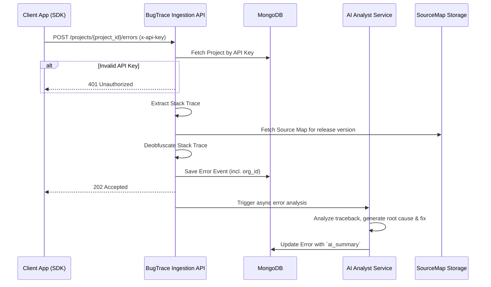
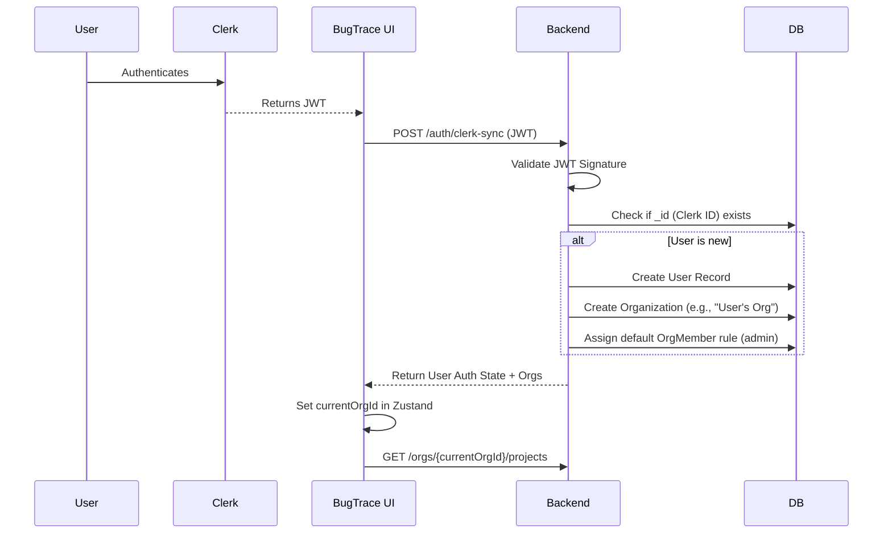

# BugTrace Multi-Tenant Architecture Upgrade

This document outlines the system design and implementation plan to transform BugTrace into a production-grade multi-tenant, scalable observability platform with advanced organization-based access control, source map deobfuscation, and AI-powered insights.

---

## 1. 📁 Folder Structure

### Backend (FastAPI)
```
collector/
├── app/
│   ├── main.py                # Entrypoint, route initialization
│   ├── core/
│   │   ├── config.py          # Environment Variables
│   │   ├── security.py        # JWT validation (Clerk logic)
│   │   └── exceptions.py      # Custom HTTPException classes
│   ├── middleware/
│   │   ├── auth_middleware.py # Validates user JWT
│   │   └── org_middleware.py  # Associates user with x-org-id parameter
│   ├── models/
│   │   ├── org_model.py
│   │   ├── project_model.py
│   │   ├── user_model.py
│   │   └── error_model.py
│   ├── schemas/               # Pydantic Request/Response validation
│   │   ├── org_schema.py
│   │   └── project_schema.py
│   ├── routes/
│   │   ├── auth.py            # /auth/clerk-sync
│   │   ├── organizations.py   # /orgs
│   │   ├── projects.py        # /orgs/{org_id}/projects
│   │   ├── sourcemaps.py      # /projects/{project_id}/sourcemaps
│   │   └── errors.py          # /projects/{project_id}/errors
│   └── services/
│       ├── org_service.py
│       ├── project_service.py
│       ├── ai_analysis.py     # AI Service Layer
│       ├── sourcemap.py       # Deobfuscation Service
│       └── db.py              # MongoDB connection
└── requirements.txt
```

### Frontend (React + Vite/Next.js)
```
bug-tracker/src/
├── App.tsx
├── main.tsx
├── components/
│   ├── layout/
│   │   ├── DashboardLayout.tsx
│   │   ├── Sidebar.tsx
│   │   └── OrgSwitcher.tsx    # Organization dropdown
│   ├── projects/
│   │   ├── ProjectCard.tsx
│   │   └── ProjectList.tsx
│   └── shared/
│       ├── Button.tsx
│       └── Modal.tsx
├── hooks/
│   ├── useAuth.ts             # Wraps Clerk auth
│   ├── useOrganization.ts     # Org state and fetching
│   └── useProjects.ts         # Project fetch with x-org-id
├── services/
│   ├── api.ts                 # Axios instance with interceptors
│   ├── orgApi.ts
│   └── projectApi.ts
├── store/
│   └── orgStore.ts            # Zustand store (currentOrg, persist)
├── pages/
│   ├── DashboardPage.tsx
│   ├── OrgSettingsPage.tsx
│   ├── ProjectDetailPage.tsx
│   └── ErrorAnalysisPage.tsx  # Includes AI insights
└── utils/
    └── queryClient.ts         # React Query instance
```

---

## 2. 🧾 MongoDB Schemas

We will use Motor (async PyMongo) or Beanie. Data models logically look like this:

```python
# models/user_model.py
class User:
    _id: str             # Clerk user ID or ObjectId
    email: str
    name: str
    last_used_org: str   # ObjectId string 
    created_at: datetime

# models/org_model.py
class Organization:
    _id: ObjectId
    name: str
    slug: str
    logo_url: Optional[str]
    owner_id: str        # User ID
    created_at: datetime

# models/org_member_model.py
class OrgMember:
    _id: ObjectId
    org_id: ObjectId
    user_id: str
    role: str            # "admin", "dev", "viewer"

# models/project_model.py
class Project:
    _id: ObjectId
    name: str
    org_id: ObjectId     # Enforcement isolation
    api_key: str         # For SDKs
    created_at: datetime
    
# models/project_member_model.py
class ProjectMember:
    _id: ObjectId
    project_id: ObjectId
    user_id: str
    role: str            # "editor", "viewer"
```

---

## 3. 🔌 FastAPI Routes (Code-Level)

```python
from fastapi import APIRouter, Depends, Header, HTTPException
from typing import List
from app.schemas.project_schema import ProjectResponse, ProjectCreate
from app.services.project_service import create_project, get_projects
from app.middleware.auth_middleware import get_current_user
from app.middleware.org_middleware import verify_org_membership

router = APIRouter(prefix="/orgs/{org_id}/projects", tags=["Projects"])

@router.post("/", response_model=ProjectResponse)
async def create_new_project(
    org_id: str,
    payload: ProjectCreate,
    user=Depends(get_current_user),
    org_membership=Depends(verify_org_membership(allowed_roles=["admin", "dev"]))
):
    """Create a new project isolated to the organization."""
    return await create_project(org_id=org_id, name=payload.name, user_id=user["_id"])

@router.get("/", response_model=List[ProjectResponse])
async def list_org_projects(
    org_id: str,
    user=Depends(get_current_user),
    org_membership=Depends(verify_org_membership(allowed_roles=["admin", "dev", "viewer"]))
):
    """List all projects under an organization, visible to members."""
    return await get_projects(org_id=org_id, user_id=user["_id"])
```

---

## 4. 🧠 Middleware Implementation

Security is layered via FastAPI `Depends()`.

```python
# app/middleware/org_middleware.py
from fastapi import HTTPException, Depends
from app.services.db import db
from app.middleware.auth_middleware import get_current_user

def verify_org_membership(allowed_roles: list = ["admin", "dev", "viewer"]):
    async def role_checker(org_id: str, user=Depends(get_current_user)):
        # 1. Look up user membership in org
        member = await db.org_members.find_one({
            "org_id": org_id,
            "user_id": user["_id"]
        })
        
        if not member:
            raise HTTPException(status_code=403, detail="Forbidden. Not a member of this organization.")
            
        if member["role"] not in allowed_roles:
            raise HTTPException(status_code=403, detail="Insufficient role permissions.")
            
        return member # Attach membership context
    return role_checker
```

---

## 5. ⚛️ React Components (Org Switcher + Project View)

### Org Store (Zustand)
```typescript
// store/orgStore.ts
import { create } from "zustand";
import { persist } from "zustand/middleware";

interface OrgStore {
  currentOrgId: string | null;
  setCurrentOrgId: (id: string) => void;
}

export const useOrgStore = create<OrgStore>()(
  persist(
    (set) => ({
      currentOrgId: null,
      setCurrentOrgId: (id) => set({ currentOrgId: id }),
    }),
    { name: "bugtrace-org-storage" }
  )
);
```

### OrgSwitcher Component
```tsx
// components/layout/OrgSwitcher.tsx
import { useQuery } from "@tanstack/react-query";
import { useOrgStore } from "../../store/orgStore";
import { api } from "../../services/api";

export const OrgSwitcher = () => {
  const { currentOrgId, setCurrentOrgId } = useOrgStore();
  
  const { data: orgs, isLoading } = useQuery(["userOrgs"], () => 
    api.get("/user/orgs").then(res => res.data)
  );

  if (isLoading) return <div className="skeleton-loader" />;

  return (
    <select 
      value={currentOrgId || ""}
      onChange={(e) => setCurrentOrgId(e.target.value)}
      className="bg-gray-800 text-white rounded px-4 py-2"
    >
      {orgs?.map((org: any) => (
        <option key={org._id} value={org._id}>
          {org.name}
        </option>
      ))}
    </select>
  );
};
```

---

## 6. 🔄 Data Flow Diagrams

### Error Ingestion Data Flow


---

## 7. 🔐 Auth Flow Diagram

### First-time Login & Clerk Sync


---

## 8. 📊 Example API Responses

### `GET /user/orgs`
```json
{
  "data": [
    {
      "_id": "60d5ecb8b311",
      "name": "Acme Corp",
      "slug": "acme-corp",
      "logo_url": "https://cdn.bugtrace.com/logos/acme.png",
      "my_role": "admin"
    },
    {
      "_id": "60d5ecc3f92",
      "name": "Personal Workspace",
      "slug": "personal",
      "logo_url": null,
      "my_role": "owner"
    }
  ]
}
```

### `GET /orgs/{org_id}/projects`
```json
{
  "data": [
    {
      "_id": "8f39b1a",
      "name": "Frontend Prod",
      "api_key": "bt_prod_991823...",
      "events_last_24h": 1205,
      "my_role": "editor"
    }
  ]
}
```

### `POST /projects/{project_id}/sourcemaps`
```json
{
  "status": "success",
  "project_id": "8f39b1a",
  "release": "v1.0.4",
  "processed_files": ["main.1a2b.js.map", "vendor.8f9b.js.map"],
  "upload_url": "https://s3.aws.com/bugtrace/sourcemaps/..."
}
```
